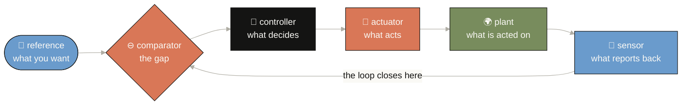

# control-anything

**A thermostat is the whole idea.**

You say what you want — 72°F. A thermometer says what you have — 68°F. The gap between
them is the *error*. The furnace does something about the gap. Then the thermometer reads
again. That "reads again" is the entire subject: without it you are **hoping**, with it you
are **controlling**.

An AI agent is a thermostat whose room is the world. It acts, the world answers, it acts
again. That is a **closed loop**, and closed loops have a hundred years of hard-won laws
about when they settle, when they oscillate, and when they tear themselves apart. We are
currently rediscovering those laws at great expense.

**This repo is the translation table — and a gate that checks your homework.**

---

## The one thing this repo does that a reading list cannot

> **A control claim is worth exactly the weakest assumption holding it up.**

Every entry carries a **guarantee level** (G0–G4) and an **assumption ledger**, and the
repo *mechanically caps* the guarantee at what those assumptions actually discharge.

"We used a model predictive controller, therefore it is safe" is the most common over-claim
in applied control. Here it is **a failing exit code**:

```console
$ ca gate mpc-humanoid-safe

🟡 mpc-humanoid-safe: claimed G3 -> effective G1 (we measured it),
                      limited by assumption:mpc-model-match
    - assumption 'mpc-model-match' is assumed (The rigid-body dynamics model matches
      the real robot closely enough over the horizon.) -> caps at G1
```

The stability theorem is about the **model**. Nobody checked the model against the robot.
So the claim is capped from *robust* to *empirical* — by arithmetic, not by taste.

<!-- BEGIN:metrics -->
| Metric | Value | What it means |
|---|---:|---|
| **over-claims caught** | **30** | claims asserting more than their assumptions earn |
| claims judged | 32 | every one passes through the gate |
| held | 2 | the guarantee stood as claimed |
| capped | 19 | downgraded to what the assumptions support |
| refused | 11 | a violated assumption, or a metaphor claiming a theorem |
| gate coverage | 1.0 | fraction of claims that reach the gate (must be 1.0) |
| unverified rate | 0.2188 | citations not resolved to a primary source |
| orphan nodes | 0 | graph nodes nothing can reach (must be 0) |
| complete LoopCards | 12/12 | domains with all six organs named |
<!-- END:metrics -->

> **Read that `unverified rate` honestly.** Every `verified: true` is backed by a recorded
> answer from its primary source (`data/resolutions.yml`) — the flag cannot be typed. What is
> left is mostly ambient folklore — "RLHF makes models aligned", "autoscaling meets the SLO" —
> deliberately recorded *as folklore*, with `verified: false`, because that is what it is.
> The number is printed rather than hidden. See [Honest edges](#honest-edges).

---

## Start here

```bash
git clone <this repo> && cd control-anything
make check                       # the whole gate: offline, no keys, ~2 seconds

python3 scripts/ca.py stats      # the numbers above
python3 scripts/ca.py gate       # judge all 32 claims
python3 scripts/ca.py loopify agent-loop     # map a system onto the six organs
python3 scripts/ca.py trace rlhf-aligned     # walk from a claim to what it rests on
```

No install needed for the CLI (`pip install -e .` if you want the `ca` entry point).
`make check` needs Python 3.11+ and `pyyaml` — nothing else, ever. That is enforced by
[`tools/layers.py`](tools/layers.py), which AST-walks every core file and fails the build
on an undeclared import, function-local ones included.

---

## The six organs (the mental model, made mechanical)

A thermostat, a humanoid robot, and an LLM agent differ in **what fills** each slot, never
in **which slots exist**. That invariance is what makes a result proved about one loop
transferable to another — and it is why `Organ` is a closed set in
[`models.py`](src/control_anything/core/models.py).

| The thermostat | The technical handle | In an LLM agent |
|---|---|---|
| the temperature you want | **reference** `r` | the user's goal, stated once |
| the gap between want and have | **comparator** `e = r − y` | *usually nothing at all* |
| the furnace's decision | **controller** `K` | the next-token policy |
| the furnace itself | **actuator** `u` | the emitted tool call |
| the room | **plant** `P` | the filesystem, the network, the user |
| the thermometer | **sensor** `C` | tool return values |



🧒 *A thermostat: you dial 72°, a thermometer says 68°, the furnace runs, the room warms,
the thermometer reads again. That last arrow — **reads again** — is the entire subject.
Cut it and you are hoping. An AI agent is this picture with the world as the room; most of
them are missing the ⊖ box entirely.*

Plus the three fields people skip, which is where real systems actually fail:

- **latency** — every loop has delay, and delay is what turns a stable controller unstable.
- **authority** — what the controller is *allowed* to do. The 737 MAX accident is one
  sentence about authority its designers did not model.
- **fallback** — what happens when the loop fails. *"Nothing"* is a valid and damning answer.

Run `ca loopify agent-loop` and read the `fallback` line. It says: **typically none.**
A thermostat built that way would burn the house down.

---

## What you can swap (the seams)

Everything at a real volatility boundary is reachable without touching the rest. Honest
inventory — this repo does **not** yet ship an abstract-base-class-plus-fake for every row,
which is the bar `anyagent` sets; where a seam is a plain parameter, the table says so.

| Seam | What it swaps | Bodies shipped | Shape |
|---|---|---|---|
| `AssumptionStatus.ceiling` | the four numbers the whole gate turns on | the default ladder | one dict, one place — the design judgement, isolated so it can be argued with |
| `ControlClaimGate(require_evidence=, require_assumptions=)` | how strict the referee is | strict (default) · permissive | constructor flags |
| `EvidenceType.ceiling` | what each kind of evidence can carry | proof → certified … analogy → anecdote | one dict |
| `Registry(root=)` | where the spine loads from | `data/*.yml` | constructor arg; the ONLY module that touches disk |
| `src/control_anything/addons/` | optional capability | *(none yet — the seam exists, declared in `data/addons.yml`)* | package boundary, enforced by `tools/layers.py` |
| `scripts/ca.py` verbs | the surface | loopify · gate · trace · graph · loops · stats | thin CLI; logic lives in `core/` |

**The boundary is enforced, not just intended.** `tools/layers.py` AST-walks every core file
and fails the build if `core/` imports anything beyond the standard library, `pyyaml`, and
itself — **function-local imports included**, because that is how a dependency actually
creeps in. Widening it means editing `CORE_THIRD_PARTY` on purpose, which makes it a
reviewed decision rather than an accident.

---

## The guarantee ladder, and the rule that makes it bite

| | Level | What it actually means |
|---|---|---|
| G0 | anecdote | it worked in a demo |
| G1 | empirical | measured on a benchmark, in-distribution |
| G2 | statistical | a bound, with a confidence level, under stated sampling assumptions |
| G3 | robust | holds for every disturbance in a stated uncertainty set |
| G4 | certified | a machine checked a proof against a formal plant model |

The jump that matters is **G1 → G2**: below it you know what *happened*, at or above it you
know what *will* happen. Most AI safety claims in 2026 live at G1 while being written in
the language of G3.

**The capping rule** — each assumption's status sets a ceiling, and the *weakest* one wins:

| Assumption status | Ceiling | Why |
|---|---|---|
| `discharged` — proven or interlocked | G4 | it is not in the way |
| `monitored` — a runtime check fires, **and something happens when it does** | G3 | you are detecting the violation, not excluding it |
| `assumed` — believed, unverified, unwatched | **G1** | you may report what you measured; you may not promise what will happen |
| `violated` — known false | G0 | refused outright |

> Marking an assumption `monitored` or `discharged` **requires naming the check**. An
> unnamed check is a wish, and wishes are what the ledger exists to catch.

### What the gate caught

<!-- BEGIN:catches -->
| Claim | Asserted | Earned | What held it back |
|---|:--:|:--:|---|
| 🟡 `mpc-humanoid-safe` | G3 | **G1** | assumption:mpc-model-match |
| ⛔ `rlhf-aligned` | G3 | **G0** | bridge:analogy |
| ⛔ `self-refine-improves` | G2 | **G0** | assumption:sr-independent-sensor |
| ⛔ `lqg-optimal-safe` | G3 | **G0** | assumption:lqg-optimality-implies-margin |
| ⛔ `agent-loop-reliable` | G3 | **G0** | assumption:al-errors-independent |
| 🟡 `eval-measures-safety` | G2 | **G1** | assumption:eval-not-optimized-against |
<!-- END:catches -->

Three of those deserve a sentence:

- **`lqg-optimal-safe`** — "it is optimal, therefore it has good stability margins." The
  field believed this for years until Doyle's 1978 counterexample, two pages long, showed
  an optimal design with a gain margin arbitrarily close to zero. Any claim of the form
  *optimal ⇒ safe* should be checked against this row.
- **`self-refine-improves`** — refused, because the critic and the generator are the same
  model. The first rule of instrumentation is that **you never close a loop on your own
  instrument.** Self-critique works with an *external* signal (tests, a compiler, the
  environment) and drifts without one.
- **`agent-loop-reliable`** — refused, because per-step errors are *not* independent. The
  model reads its own earlier mistakes and conditions on them. That is positive feedback,
  and positive feedback with no fallback is how Tacoma Narrows came down.

---

## The twelve domains

A domain earns a row only if it produces a **complete LoopCard**. If you cannot say what
the sensor is, it is not a control problem. Twelve, closed set — growth happens by
*deepening*, never by appending a thirteenth.

<!-- BEGIN:domains -->
| Domain | The loop in one line | Control maturity |
|---|---|---|
| **Generative AI** | noise is pushed toward data by following a learned score; guidance adds a steering term | `adopting` |
| **Agentic AI** | a model emits an action, a tool returns an observation, and the observation re-enters the context | `metaphorical` |
| **Physical AI** | a learned policy reads sensors and writes joint commands at a fixed, unforgiving rate | `adopting` |
| **Robotics** | desired pose in, joint torques out, encoders and IMU closing the loop at kilohertz | `native` |
| **World models** | predict the next state from the current one, plan against the prediction, act, correct | `adopting` |
| **Alignment & AI safety** | humans rate outputs, a reward model learns the rating, and a penalty keeps the model near a known-good point | `metaphorical` |
| **Autonomous driving** | perceive, predict other agents, plan a trajectory, track it with a low-level controller | `native` |
| **AI infrastructure** | measure latency and queue depth, then adjust batch size, replica count, and clock speed | `adopting` |
| **Medicine & biology** | a sensor reads a physiological variable and a pump or stimulator acts, continuously, on a body | `native` |
| **Power & energy** | generation is trimmed continuously so supply matches demand and frequency holds | `native` |
| **Aerospace** | pilot or autopilot commands an attitude; surfaces move; sensors close the loop under envelope limits | `native` |
| **Markets & mechanisms** | prices respond to orders, participants respond to prices, and the loop can run away | `adopting` |
<!-- END:domains -->

---

## Rigorous, or a metaphor? (the sharpest edge in the repo)

"Control theory applied to AI" is **sometimes a theorem and sometimes a vibe**, and
conflating the two is the failure this repo most fears. Every bridge is typed:

- **`rigorous`** — diffusion sampling **is** stochastic optimal control (the reverse-time
  SDE is literally the controlled process, the score is literally the control); flow
  matching **is** a transport equation; policy gradient on the linear quadratic regulator
  **has** a global convergence proof. These are results, with DOIs.
- **`analogy`** — "context is a saturating actuator", "Reflexion is integral action in
  text". Useful framings. Not theorems.

**An `analogy` claiming G3 or above is refused outright.** A structural metaphor cannot
carry a guarantee.

The live centre of the rigorous bridge is a small, tightly connected cluster — the
mean-field-control and optimal-transport line running through UCLA, Emory, Duke and now
Peking University — not the diffusion-model labs. See [`data/works.yml`](data/works.yml)
for the `bridge: rigorous` rows and their DOIs.

---

## What's inside

<!-- BEGIN:corpus -->
| Node kind | Count | What it holds |
|---|---:|---|
| concepts | 56 | control ideas, each mapped to a loop organ |
| people | 68 | contributors, each owning exactly one concept |
| works | 86 | papers and books, each with a resolvable citation |
| labs | 16 | groups that own a line of work |
| applications | 34 | deployed loops, with the guarantee actually claimed |
| questions | 27 | open problems and honest progress |
| claims | 32 | assertions the gate judges |
| loop cards | 12 | systems mapped onto the six organs |
| **graph** | **337 nodes / 863 edges** | the knowledge base, typed and reachability-gated |
<!-- END:corpus -->

### Why a graph and not a list

A list answers *"what do we know about MPC?"*. A graph answers *"which assumption is
load-bearing for this claim, who first stated it, in what paper, and which other domain
already learned it the hard way?"* Three invariants are gated in CI:

1. **No orphans.** A fact nobody can reach is a fact nobody will maintain.
2. **Gate coverage is 1.0.** No claim reaches output without being judged.
3. **Every concept maps to an organ.** If a control idea cannot be placed on the six-organ
   loop, either it is out of scope or the ontology is wrong. Both are worth knowing.

### The most useful thing in the corpus, if you only read one file

[`data/applications.yml`](data/applications.yml) — 34 deployed control loops and the
guarantee each *actually* claims. The finding:

> **Almost nothing claims `certified`**, and where it does, "certified" means a pass/fail
> track test or a process standard — never a proof that the deployed loop is stable. Every
> machine-learning controller in there tops out at `empirical` or `statistical`, with
> safety delegated to **a constraint layer plus a human override** rather than to the
> learned policy itself.

That is not a criticism of the field. It is **the template**: the learned part is *allowed*
to be untrustworthy because something else holds the guarantee. The datacenter-cooling row
is the closest thing in deployed practice to a blueprint for safe agentic AI — actions
vetted against operator constraints *and* re-verified by a separate local controller,
low-confidence actions discarded, automatic failover to heuristics, human exit at any time.

---

## Repo layout

```
control-anything/
├── GOAL.md                    the 10x contract — §0 evaluates the request before anything else
├── Makefile                   `make check` = the offline, deterministic finish line
├── .github/workflows/check.yml CI runs the same `make check` on every push and PR
├── data/*.yml                 THE SINGLE SOURCE OF TRUTH. Nothing downstream is hand-edited.
├── src/control_anything/
│   ├── core/                  models · claim_gate · graph · registry · citations (stdlib + pyyaml ONLY)
│   └── addons/                optional capability, reached through seams
├── scripts/ca.py              the CLI: loopify · gate · trace · brief · graph · loops · stats
├── scripts/resolve.py         the ONE networked script: asks arXiv/doi.org/the web about every source
├── scripts/readme.py          regenerates this file's tables; `--check` gates drift
├── tools/check.py             spine gate — every foreign key resolves, every `verified: true` is earned
├── tools/layers.py            the layering law, enforced by AST walk
├── tests/                     pytest, including mutation tests on the gate itself
└── docs/                      ARCHITECTURE · REPO_PLAYBOOK
```

| Target | What it gates |
|---|---|
| `make check` | everything below, in order. Exit 0 = green. |
| `make spine` | the data loads, every foreign key resolves, no duplicate ids, and every `verified: true` has a recorded answer from its primary source in `data/resolutions.yml` |
| `make layers` | core imports only stdlib + pyyaml + core |
| `make graph` | 0 orphans · gate coverage 1.0 · every concept mapped |
| `make gate` | the gate catches ≥ 12 over-claims — *a gate that never fires is decorative* |
| `make readme-check` | these tables still match `data/` |
| `make ainative` | the repo still has the organs it claims to have |
| `make test` | pytest |
| `make resolve` | *not in `check` — the one networked target.* Asks arXiv / doi.org / Open Library / the page itself about every source handle and records the real title in `data/resolutions.yml` |
| `make brief D=robotics` | *not a gate — a reader.* One domain on one page: its loop, its claims judged, the weakest assumption under each, what is still open. Dated by the data, not the clock |

---

## Tested to the gate

```bash
make check                 # the whole finish line: offline, no keys, no network, ~2s
python3 -m pytest -q       # the suite
python3 scripts/ca.py stats
```

Every gate is a script, not an opinion. The suite includes **four mutation tests** that
break the capping rule in different ways and assert the suite notices — because a gate
that passes its own happy path proves nothing, and a gate that cannot fail is decorative.
Inverting `min` to `max` on the assumption ledger, or dropping the violated-assumption
refusal, both turn the suite red.

The tests also assert **the numbers this repo publishes in prose**
(`tests/test_published_numbers.py`): 32 claims, 30 caught, `unverified_rate` 0.22. Changing
a number now requires changing the article that states it, in the same commit. That coupling
is what makes silent drift impossible rather than merely unlikely.

---

## Docs

| Doc | What's in it |
|---|---|
| [`GOAL.md`](GOAL.md) | The 10x contract. §0 evaluates the request itself before anything is built, names what was weak in it, and records the three decisions only the owner could make |
| [`docs/ARCHITECTURE.md`](docs/ARCHITECTURE.md) | The shape in two diagrams: the spine → core → gates pipeline, and the capping rule on one real claim. Why the graph is stdlib and what determinism buys |
| [`docs/REPO_PLAYBOOK.md`](docs/REPO_PLAYBOOK.md) | The reusable `<X>-anything` pattern. §5 holds the seven lessons this repo earned; §6 is the README contract that this file is checked against |
| [`CONTRIBUTING.md`](CONTRIBUTING.md) | The contribution gate — every claim carries its assumption ledger. Also the fastest useful contribution: find a ledger that is wrong |
| [`CHANGELOG.md`](CHANGELOG.md) | What changed and why, including an *Investigated / Rejected* section so dead ends are not re-litigated |
| [`CLAUDE.md`](CLAUDE.md) | The agent guide: invariants you must not break, and the honesty rules specific to this corpus |
| [`skills/control-anything/SKILL.md`](skills/control-anything/SKILL.md) | The portable version — run the five-step judgement by hand, with no repo and no tooling |
| [`llms.txt`](llms.txt) | The machine-readable summary for answer engines and agents |

---

## Provenance

**Runtime is Python 3.11+ and `pyyaml`. Nothing else, ever** — enforced by
[`tools/layers.py`](tools/layers.py), which fails the build on an undeclared import.
`pytest` is the only development dependency.

What this repo deliberately does **not** carry: no network calls anywhere under
`make check`, no API keys (`tests/conftest.py` strips provider keys so nothing can go live
even by accident), no clock, no randomness, and no vendored copies of the work it cites —
every external source is a resolvable DOI, arXiv id, URL, or ISBN — and every one marked
verified has been resolved: `data/resolutions.yml` records the title each primary service
actually returned.

The corpus was assembled by five bounded research passes with strict VERIFIED / UNVERIFIED
output contracts. Rows that could not be resolved against a primary source are marked
`verified: false` rather than asserted, and the resulting `unverified_rate` is published
rather than narrowed to a flattering subset. Two contested death dates are recorded as
unverified for exactly this reason — they are real people.

---

## Honest edges

Stated here, before anyone finds them.

- **The gate encodes a judgement, not a theorem.** The G0–G4 ladder and the capping rule
  are *our* design. They are defensible and mechanical — they are not a result anyone
  proved. The four ceiling values live in one place
  ([`AssumptionStatus.ceiling`](src/control_anything/core/models.py)) so they can be argued
  with.
- **`unverified_rate` is 0.22 and that is the real number — 7 of 32 claims.** It was 0.53
  until "verified" stopped being a flag someone typed: a claim or work now counts as verified
  only when every handle in its source (arXiv id, DOI, URL, ISBN) has a recorded answer from
  its primary service in `data/resolutions.yml`, written by `make resolve`. Six of the seven
  left are ambient folklore recorded *as* folklore — no primary source exists by design; the
  seventh (`envelope-protection`) rests on DO-178C, a paywalled standard no script can open.
  A resolution proves the source **exists and is what it says**; whether it *supports* the
  claim is still a human reading, recorded in `data/claims.yml`.
- **Verification is bounded by what a research pass could confirm.** Two people's death
  dates were reported by a secondary source and are marked `verified: false` rather than
  asserted, because these are real people. Several 2026-dated works are recent enough that
  venue confirmation was not always reachable.
- **`make ainative` is crude.** It checks that the repo still *has* the organs it claims —
  not that they are any good. Organ loss is a real failure mode; organ quality is not
  something a file-existence check can see.
- **No live plant.** Nothing here runs a robot or calls a model. The gate is offline and
  deterministic by design — that is what makes it CI-safe and drift-checkable, and it is
  also a hard limit on what it can prove.
- **Twelve domains is a stopping rule, not a claim of completeness.** Quantum control,
  chemical process safety and air-traffic management would all qualify and are absent.

---

## Contributing

The community organ is a **gated protocol**, not an invitation. A new entry must carry its
assumption ledger and pass `make check`. That gate is the shared language that makes a
stranger's pull request reviewable in five minutes. See
[`CONTRIBUTING.md`](CONTRIBUTING.md).

The fastest useful contribution: **find a claim in `data/claims.yml` whose assumption
ledger is wrong** — an assumption we marked `assumed` that you can show is monitored in
practice, or one we marked `monitored` whose check does not actually fire. Either direction
moves a number.

---

## Reading

The long-form writeup of the idea in this repo — the ladder, the capping rule, the 32-claim
run with its scope stated, and a 30-minute build:
**[The Assumption Ledger: a Safety Guarantee Is Capped by the One Thing Nobody Checked](https://agentic-portfolio-lovat.vercel.app/articles/assumption-ledger.html)**
(also in [中文](https://agentic-portfolio-lovat.vercel.app/articles/assumption-ledger.zh-CN.html) ·
[Español](https://agentic-portfolio-lovat.vercel.app/articles/assumption-ledger.es.html) ·
[한국어](https://agentic-portfolio-lovat.vercel.app/articles/assumption-ledger.ko.html) ·
[日本語](https://agentic-portfolio-lovat.vercel.app/articles/assumption-ledger.ja.html)).

## Related

Same operating system, different domains: `research-anything`, `FDE-os`, and the
`<X>-os` / `<X>-anything` family. The shared pattern is written down in
[`docs/REPO_PLAYBOOK.md`](docs/REPO_PLAYBOOK.md).

## License

MIT. See [`LICENSE`](LICENSE).
