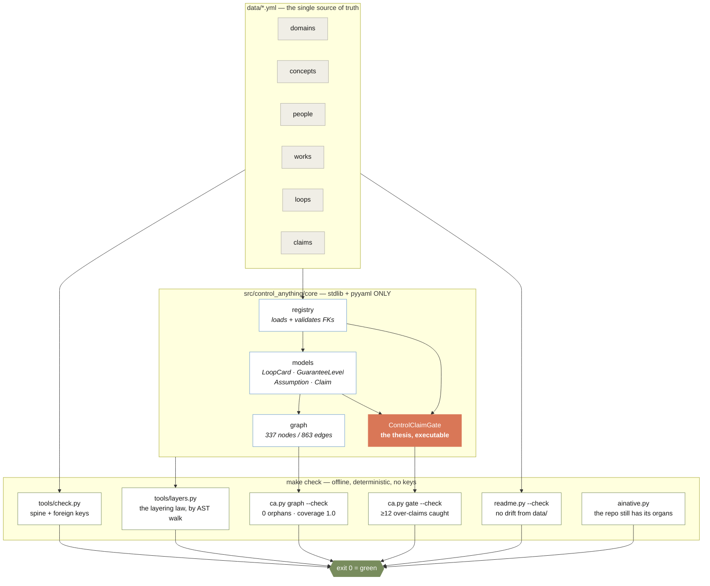
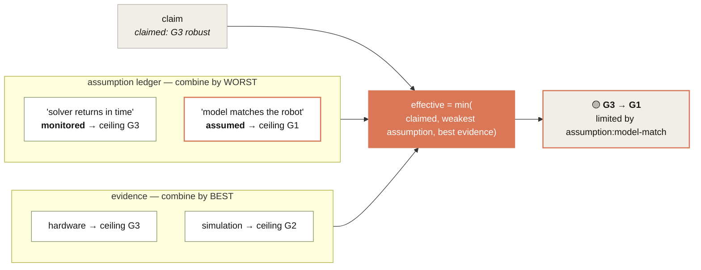

# Architecture

## The shape, in one picture

## The gate, in one picture

This is the whole idea. A claim asserts a level; the gate computes what it earned.

**Why `min` on assumptions and `max` on evidence.** A chain is as strong as its weakest
link — one unchecked assumption undermines the whole guarantee, no matter how many good
ones surround it. Evidence is not a chain: having an analogy alongside a proof does not
weaken the proof. Inverting either is a mutation test in `tests/test_claim_gate.py`.

## The layering law

Core may import the standard library, `pyyaml`, and other core modules. Nothing else, ever.

`tools/layers.py` enforces it by walking the AST, so a **function-local** import counts
exactly like a top-level one — which is how dependencies actually creep in. A sibling repo's
equivalent check found two hidden edges on its first run that no top-of-file grep had shown.

Adding a core dependency means editing `CORE_THIRD_PARTY` in that file, on purpose. That
makes it a reviewed decision rather than an accident, because it widens what `make check`
needs on a bare machine — and "green on a bare machine" is what makes every generated
surface drift-checkable.

## Why the graph is stdlib

`networkx` was considered and rejected: it would put a third-party dependency in the core.
Roughly sixty lines of breadth-first search over adjacency dicts covers every query the
repo makes (`reachable`, `trace`, `degree`), and the invariants are all reachability
questions.

## Determinism

No clock, no network, no randomness anywhere under `make check`. `tests/conftest.py` strips
provider API keys so nothing can go live even by accident. Ties are broken by id — see
`Claim.weakest_assumption` — so verdicts are byte-identical across runs and machines.

That property is load-bearing, not cosmetic: it is precisely what lets the README's tables
be *generated* and then **drift-gated**. A flaky gate cannot check a document.
